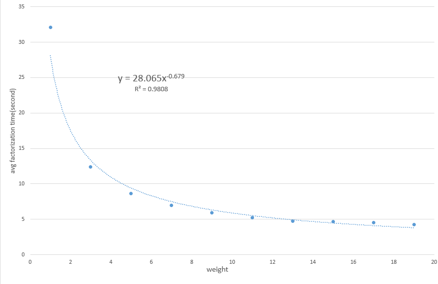

# Project 3 report
team 10 (Han Suhwan, Park Seongwon, Roh Yoonmi)

## Modified files

### kernel
* arch/arm/include/asm.unistd.h
* arch/arm/kernel/calls.S
* include/linux/init_task.h
* include/linux/interrupt.h
* include/linux/sched.h
* include/linux/sched/wrr.h
* include/linux/syscalls.h
* include/uapi/linux/sched.h
* kernel/sched/core.c
* kernel/sched/debug.c
* kernel/sched/rt.c
* kernel/sched/sched.h
* kernel/sched/wrr.c
* kernel/softirq.c

### test program
* test/test.h
* test/trial.c

## How to run

### Building kernel
```
build
```

### Building test program
```
cd test
make
push trial /root/trial
```

### Running test program
```
./trial
```

### Implementation

#### Implementing classes
We need to implement three classes, `wrr_sched_class`, `wrr_rq`, and `wrr_entity`.
`wrr_sched_class` has function pointers to actually run wrr.
`wrr_rq` is used in `rq`, and have a lock and list of wrr tasks. It also has number of tasks in `rq` and sum of their weight to use in loadbalancing.
`wrr_entity` is used in `task_struct` and has variables used in wrr such as weight.

#### Initializing data
On initializing scheduler, call loadbalance to move existing tasks to newly created scheduler.
When initializing `rq`, also initialize `wrr_rq`, initializing lock, list and variables.
On enqueueing wrr task, initialize wrr entity with default weight and timeslice if they are not already set.

#### Implementing system calls
In setweight, first check whether input is correct, and if user is root or owner of that task.
Root can set weight to any valid value, owner can only decrease weight of task.
Getweight first check if input pid exists and that task's policy is wrr. if it is, return weight of that task.

#### Changes in existing classes
Scheduler classes have priority, and in spec, priority of wrr is between rt and fair. so set next class of rt to wrr, and next class of wrr to fair.
Add new values to softirq, to make wrr scheduled tasks interruptable.

#### Implementing WRR class functions

##### `enqueue_task_wrr` and `dequeue_task_wrr`
Add `task_struct` to `wrr_rq` recalculate variables in `wrr_rq`
Lock is held outside this function, so we do not need to worry about synchronization here.

##### `yield_task_wrr`
Remove current task from wrr and requeue it. Special case is when queue has only one task.

##### `pick_next_task_wrr`
Chooses next task, which is the front element of `wrr_rq`

##### `put_prev_task_wrr`
Update current task's runtime statistics. Everything else that need to be done are handled outside this function.

##### `select_task_rq_wrr`
Choose rq to put task. Traverse online cpus and choose one that has minimum weight sum, then return number of choosen cpu. We will need rcu lock here for synchronization.

##### `set_curr_task_wrr`
Set start time of current task. Everything else is handled outside this function.

##### `task_tick_wrr`
Reduce task's timeslice by one, and if it becomes 0, then it means that rq have to switch to next task. So reset current task's timeslice and then put it at back of queue.

##### `get_rr_interval_wrr`
Calculate given task's timeslice with weight and return calculated value.

#### Implementing loadbalance
When triggered, first find runqueue with minimum weight sum and maximum weight sum by traversing online cpus. We used `rcu_read_lock` to assure synchronization.
If it is possible to migrate, then use `double_rq_lock` to hold locks for both rqs, and traverse tasks in rq with maximum weight sum and find task with maximum migratable task.
If we found one, then dequeue that task from maximum rq and enqueue it in minimum rq, then unlock both locks.

#### Setting WRR to default scheduler
Change codes in `include/linux/init_task.h`, `kernel/kthread.c`, and `kernel/sched/core.c`. Change their policy to `SCHED_WRR`.

#### Other functions
Some functions, such as `check_preempt_curr` does not need to do anything, because all mendatory things are done outside of function.

### Investigation
To figure out the difference of throughput among various weighted task, we should run dummy tasks.
When executing `trial` alone, the `trial` task is hardly interrupted.
As a result, regardless of the weight, factorizing time of prime number `100000007` is about 2 seconds.

First of all, run 8 dummy tasks to enqueue each task to every cpus.
Then run the `trial` task to measure factorizing time of prime number `100000007`.
We repeatly measured difference between end time to start time and calculated the average, for every weight.

The [graph](plot.pdf) below shows relationship between weight and the average factorization time(in second).




### Optimizations
//TODO
